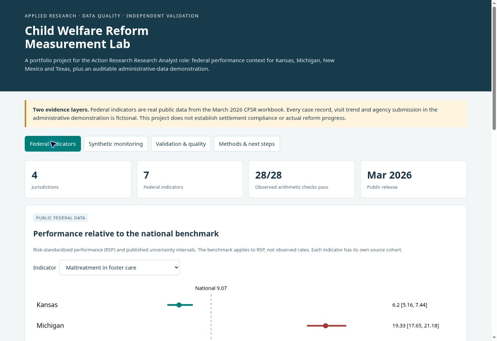

# Child Welfare Reform Measurement Lab

A runnable applied-research portfolio project tailored to the **Action Research Research Analyst** job description. It demonstrates administrative data management, independent performance validation, data quality assessment, visualization, and communication for child welfare monitoring teams.

**Live dashboard:** https://lugureign.github.io/child-welfare-reform-lab/



**Start here:** open `output/dashboard.html` in a modern browser. It runs entirely offline. Read `docs/executive_memo.md` for findings and `docs/measure_specification.md` for eligibility rules.

## Evidence layers

1. **Real public data:** 28 indicators (seven indicators × Kansas, Michigan, New Mexico and Texas) extracted from the original Children's Bureau March 2026 CFSR Round 4 workbook. Original PDF, extracted text, source pages, cohorts, numerators, denominators and checksums are included.
2. **Clearly synthetic administrative exercise:** seeded fictional child, care-episode and visit records. It demonstrates cleaning, eligibility construction, independent aggregation, quarterly monitoring and reconciliation against fictional submissions containing known defects. State labels are for demonstration only.

The project is not affiliated with Action Research or a monitoring team. It makes no claim about settlement compliance, actual visit coverage, causal reform effects or individual children's risk. The public release is a snapshot, not a historical state reform series.

## Run and verify

Python 3.10+; **no third-party dependencies**.

```bash
python run_pipeline.py
python -m unittest discover -s tests -v
```

The pipeline runs without internet. It extracts the public rows from bundled text, recreates seeded synthetic inputs, cleans them, builds a normalized SQLite warehouse, calculates measures, reconciles submissions, writes all audit outputs, and rebuilds the standalone dashboard. It intentionally regenerates synthetic inputs: do not replace them with confidential administrative records. For real work, implement a controlled ingest mode and jurisdiction-approved specifications first.

The bundled text was produced using `pdftotext -layout` from the original PDF. To re-extract it with Poppler installed:

```bash
pdftotext -layout data/source/cfsr-march-2026.pdf data/source/cfsr-march-2026.txt
python run_pipeline.py
```

## Role-to-project mapping

| Job duty | Reviewable evidence |
|---|---|
| Data cleaning and management | `run_pipeline.py`, normalized `output/warehouse.sqlite`, clean tables, `quality_audit.csv`, data dictionary |
| Reproducible quantitative analysis | Seeded source generation, full-month eligibility, state-quarter and age-at-entry analysis |
| Performance validation | Public numerator/denominator arithmetic; separate Python and SQL visit aggregation; fictional submission reconciliation |
| Quality assurance | Boundary and defect tests; count conservation; foreign-key checks; source checksums; reviewer checklist |
| Visualization | Interactive interval chart, federal comparison matrix, synthetic quarterly trends, denominator tables and audit summaries |
| Communication and engagement | Executive memo, technical measure specification and partner discussion questions |
| Reform monitoring and coordination | Workplan, measure register, issue ownership template and evidence needed before any compliance determination |
| Qualitative support and learning | Interview guide, thematic codebook and mixed-method synthesis template; no invented interviews |

## Files

- `data/source/`: original public PDF and layout text.
- `data/raw/`: explicitly fictional inputs and agency submissions.
- `output/public_indicators.csv`: public extraction and validation, retaining source row/page.
- `output/clean_*.csv`, `quality_audit.csv`, `quality_summary.csv`: dispositions and lineage.
- `output/warehouse.sqlite`: children → episodes → visits and eligible episode-months; foreign keys and indexes.
- `output/synthetic_trends.csv`, `synthetic_age_groups.csv`: aggregate demonstration results.
- `output/agency_reconciliation.csv`: submitted and independently calculated counts/rates.
- `output/run_manifest.json`: hashes, source release and reproducibility checks.
- `output/dashboard.html`: standalone interactive executive dashboard.
- `docs/`: memo, specifications, dictionary, workplan, QA and qualitative materials.

## Design decisions and limits

- Comparisons with national benchmarks use **risk-standardized performance (RSP)** and published intervals. Observed performance is recalculated separately; it is not compared to the national benchmark.
- Published RSP is imported, not rebuilt from microdata. Interval classification replication uses rounded published limits; a boundary can be ambiguous at their displayed precision.
- Federal indicators refer to different cohorts. Do not average their rates or infer a single state ranking.
- The administrative measure is a custom full-month in-person visit indicator, not a federal CFSR or legal settlement specification.
- Partial months are excluded; episodes use half-open intervals `[entry, exit)`. Missing visits are not documented in-person visits, with recording completeness as a key limitation.
- Exact duplicates are removed. Conflicting keys, overlapping episodes and invalid/orphan records are quarantined and logged. Quarantine is an unresolved quality issue, not proof the underlying care did not occur.
- Synthetic age comparisons are descriptive and repeated child-months are correlated. No statistical significance or causal claims are made. Masking denominators below 20 is illustrative and does not replace a production disclosure review.
- No person-level model, protected-characteristic inference, LLM interpretation of case files or fabricated qualitative evidence is included.

## Source and reuse

Children's Bureau, *CFSR Round 4 Statewide Data Indicators Workbook*, March 2026, retrieved October 8, 2026: https://www.cfsrportal.acf.hhs.gov/document/download/gLMYON

Official methods, syntax and definitions: https://www.cfsrportal.acf.hhs.gov/resources/round-4-resources/cfsr-round-4-statewide-data-indicators

Repository code is MIT licensed; included federal source material is attributed separately. No authorship or endorsement of federal source content is claimed.
